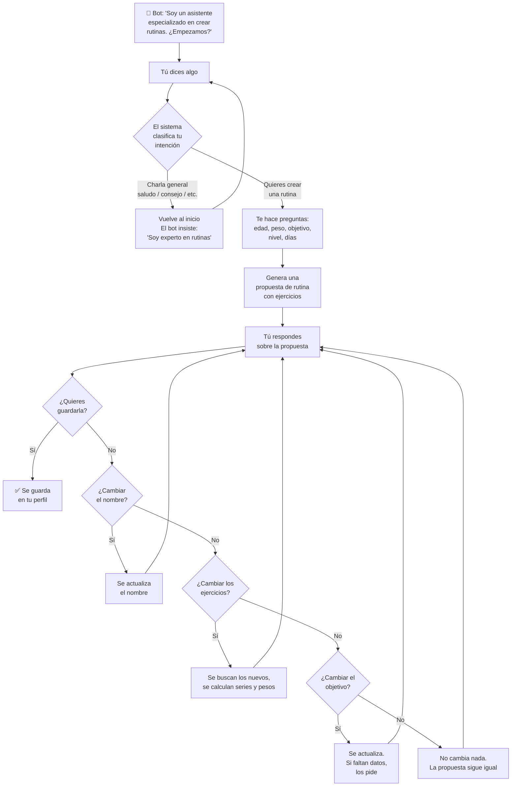
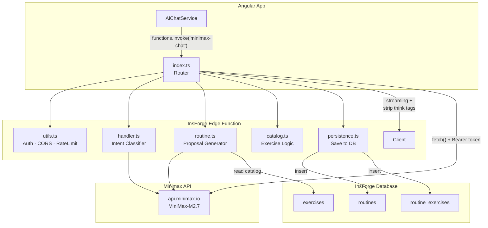
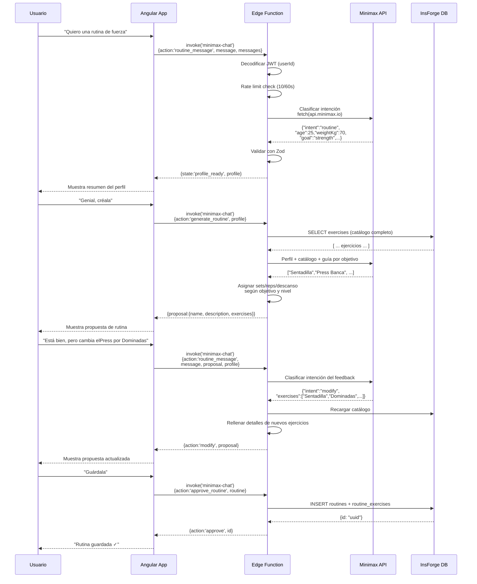
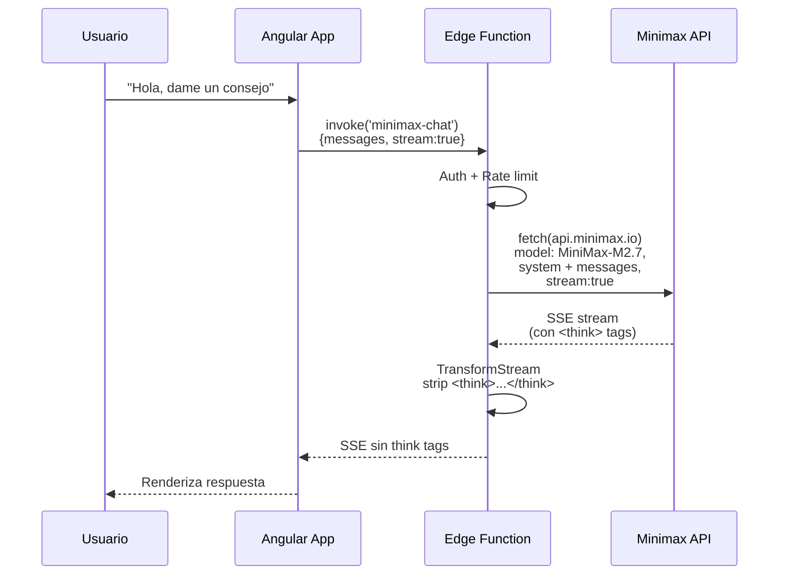
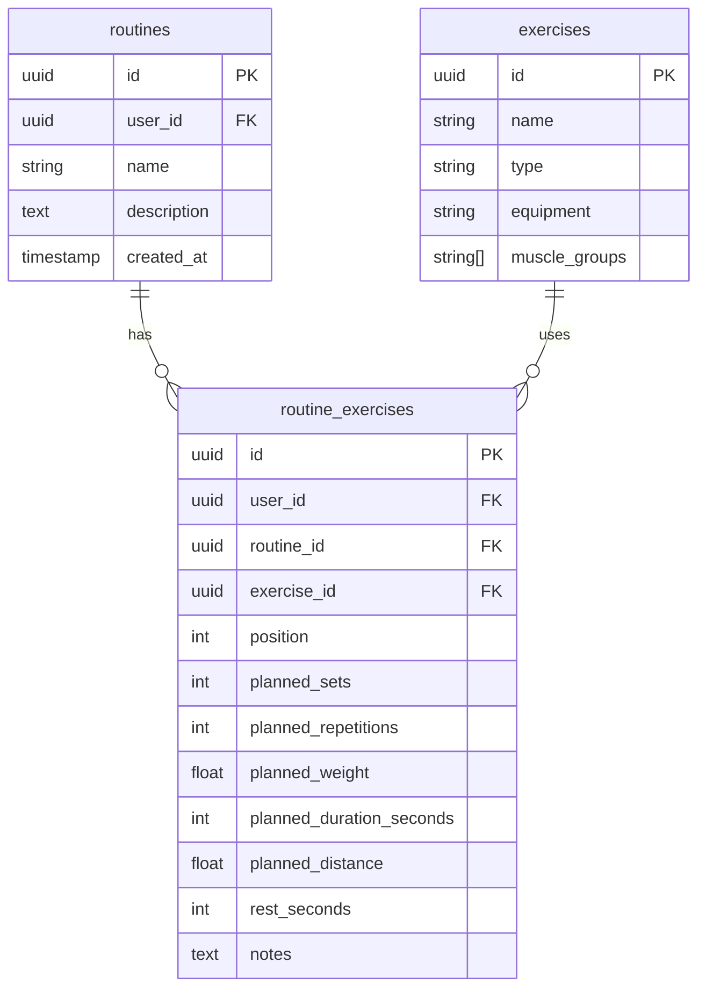

# Minimax Chatbot Flow

## Visión funcional completa

```mermaid
flowchart TD
  S["🤖 Bot: 'Soy un asistente<br/>especializado en crear<br/>rutinas. ¿Empezamos?'"] --> U[Tú dices algo]
  U --> C{El sistema<br/>clasifica tu<br/>intención}
  C -->|Charla general<br/>saludo / consejo / etc.| VUELVE["Vuelve al inicio<br/>El bot insiste:<br/>'Soy experto en rutinas'"]
  C -->|Quieres crear<br/>una rutina| P[Te hace preguntas:<br/>edad, peso, objetivo,<br/>nivel, días]
  P --> PROP["Genera una<br/>propuesta de rutina<br/>con ejercicios"]
  PROP --> FB[Tú respondes<br/>sobre la propuesta]

  FB --> AP{¿Quieres<br/>guardarla?}
  AP -->|Sí| OK["✅ Se guarda<br/>en tu perfil"]
  AP -->|No| RN{¿Cambiar<br/>el nombre?}
  RN -->|Sí| NOM["Se actualiza<br/>el nombre"]
  RN -->|No| EJ{¿Cambiar los<br/>ejercicios?}
  EJ -->|Sí| MOD["Se buscan los nuevos,<br/>se calculan series y pesos"]
  EJ -->|No| OBJ{¿Cambiar el<br/>objetivo?}
  OBJ -->|Sí| GOAL["Se actualiza.<br/>Si faltan datos,<br/>los pide"]
  OBJ -->|No| NADA["No cambia nada.<br/>La propuesta sigue igual"]

  VUELVE --> U
  NOM --> FB
  MOD --> FB
  GOAL --> FB
  NADA --> FB
```

## Arquitectura general

```mermaid
graph TB
  subgraph Frontend["Angular App"]
    A[AiChatService] -->|"functions.invoke('minimax-chat')"| EF
  end

  subgraph EdgeFunction["InsForge Edge Function"]
    EF[index.ts<br/>Router] --> UT[utils.ts<br/>Auth · CORS · RateLimit]
    EF --> H[handler.ts<br/>Intent Classifier]
    EF --> R[routine.ts<br/>Proposal Generator]
    EF --> C[catalog.ts<br/>Exercise Logic]
    EF --> P[persistence.ts<br/>Save to DB]
    EF -->|"streaming +<br/>strip think tags"| Client
  end

  subgraph AI[Minimax API]
    MM[api.minimax.io<br/>MiniMax-M2.7]
  end

  subgraph DB[InsForge Database]
    EX[exercises]
    RT[routines]
    RE[routine_exercises]
  end

  EF -->|"fetch() + Bearer token"| MM
  H --> MM
  R --> MM
  R -->|"read catalog"| EX
  P -->|"insert"| RT
  P -->|"insert"| RE
```

## Flujo completo: creación de rutina

```mermaid
sequenceDiagram
  participant U as Usuario
  participant A as Angular App
  participant EF as Edge Function
  participant MM as Minimax API
  participant DB as InsForge DB

  U->>A: "Quiero una rutina de fuerza"
  A->>EF: invoke('minimax-chat')<br/>{action:'routine_message', message, messages}

  EF->>EF: Decodificar JWT (userId)
  EF->>EF: Rate limit check (10/60s)
  EF->>MM: Clasificar intención<br/>fetch(api.minimax.io)
  MM-->>EF: {"intent":"routine",<br/>"age":25,"weightKg":70,<br/>"goal":"strength",...}

  EF->>EF: Validar con Zod
  EF-->>A: {state:'profile_ready', profile}
  A-->>U: Muestra resumen del perfil

  U->>A: "Genial, créala"
  A->>EF: invoke('minimax-chat')<br/>{action:'generate_routine', profile}

  EF->>DB: SELECT exercises (catálogo completo)
  DB-->>EF: [ ... ejercicios ... ]
  EF->>MM: Perfil + catálogo + guía por objetivo
  MM-->>EF: ["Sentadilla","Press Banca", ...]
  EF->>EF: Asignar sets/reps/descanso<br/>según objetivo y nivel
  EF-->>A: {proposal:{name, description, exercises}}
  A-->>U: Muestra propuesta de rutina

  U->>A: "Está bien, pero cambia elPress por Dominadas"
  A->>EF: invoke('minimax-chat')<br/>{action:'routine_message',<br/>message, proposal, profile}

  EF->>MM: Clasificar intención del feedback
  MM-->>EF: {"intent":"modify",<br/>"exercises":["Sentadilla","Dominadas",...]}
  EF->>DB: Recargar catálogo
  EF->>EF: Rellenar detalles de nuevos ejercicios
  EF-->>A: {action:'modify', proposal}
  A-->>U: Muestra propuesta actualizada

  U->>A: "Guárdala"
  A->>EF: invoke('minimax-chat')<br/>{action:'approve_routine', routine}

  EF->>DB: INSERT routines + routine_exercises
  DB-->>EF: {id: "uuid"}
  EF-->>A: {action:'approve', id}
  A-->>U: "Rutina guardada ✓"
```

## Flujo: chat libre (sin intención de rutina)

```mermaid
sequenceDiagram
  participant U as Usuario
  participant A as Angular App
  participant EF as Edge Function
  participant MM as Minimax API

  U->>A: "Hola, dame un consejo"
  A->>EF: invoke('minimax-chat')<br/>{messages, stream:true}

  EF->>EF: Auth + Rate limit
  EF->>MM: fetch(api.minimax.io)<br/>model: MiniMax-M2.7,<br/>system + messages,<br/>stream:true

  MM-->>EF: SSE stream<br/>(con <think> tags)
  EF->>EF: TransformStream<br/>strip <think>...</think>
  EF-->>A: SSE sin think tags
  A-->>U: Renderiza respuesta
```

## Modelo de datos

```mermaid
erDiagram
  routines {
    uuid id PK
    uuid user_id FK
    string name
    text description
    timestamp created_at
  }

  routine_exercises {
    uuid id PK
    uuid user_id FK
    uuid routine_id FK
    uuid exercise_id FK
    int position
    int planned_sets
    int planned_repetitions
    float planned_weight
    int planned_duration_seconds
    float planned_distance
    int rest_seconds
    text notes
  }

  exercises {
    uuid id PK
    string name
    string type
    string equipment
    string[] muscle_groups
  }

  routines ||--o{ routine_exercises : has
  exercises ||--o{ routine_exercises : uses
```
